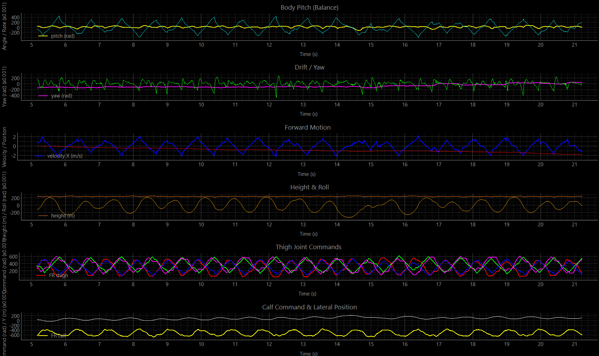

This project contains a simulation of quadruped walk that is developed by CPG+LQR+PID controllers.

<!--  -->
<!--  -->


## Install

```bash
python3 -m venv ./venv
source venv/bin/activate
pip install -r requirements.txt

sudo apt-get install build-essential cmake git libzmq3-dev libeigen3-dev 

```

## Run

To see the quadruped walk we need to run three files. They are located in different directories.

First file you need to launch is controller:
```bash
cd controllers
python cpg_controller_walk.py
```

Then the simulator:
```bash
cd sim
python simulator.py
```

And at the end should be launched a code to plot variables:
```bash
cd assets
python rt-plotter.py
```

Note. For ubuntu 26.04 and wayland use `PYGLFW_LIBRARY_VARIANT=wayland python simulator.py`

## Results


If there's no video or it doesn't show anything, then you can find it in `docs/quadruped_walk.mp4`.
<video width="100%" controls>
  <source src="docs/quadruped_walk.mp4" type="video/mp4">
</video>