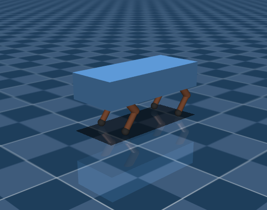
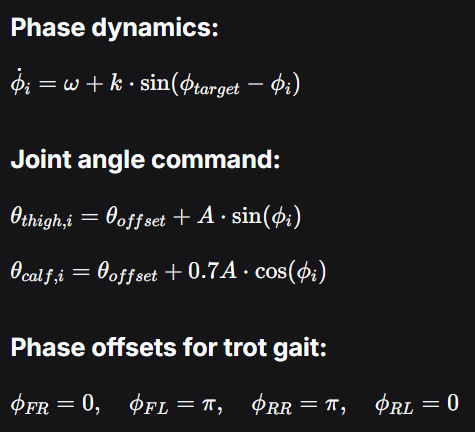
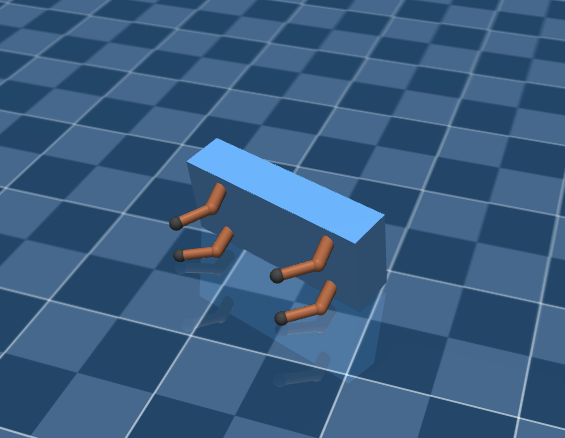
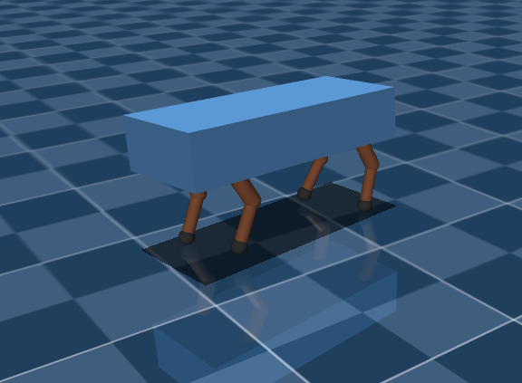

This project contains a simulation of quadruped walk that is developed by CPG+LQR+PID controllers.

## Story
We have taken the reference of Google Unitree A1 robot, that you may find in this link: https://github.com/google-deepmind/mujoco_menagerie/tree/main. It has been taken as a base for .xml file for DeepSeek that has created for us .xml file of simplified quadruped.   



Then we have asked DeepSeek about which controller suits better for our quadruped: it says that one of the best is Central Pattern Generator (CPG).
This one describes movement of legs by phase and can be found in method `compute_gait` (of cpg_controller_walk file). Also one of the most important thing was to understand what is walk? The walk can be described by simultaneously moving two legs diagonally. As a control input we have used the data from devices itself but in real world we should rely only on voltage control but it can be easily carried out if we just make "transformation"  between voltages and state of joints. 



The first trouble was about unnatural movement: the robot was changing his joints too unnaturally and fast (and it was able to make backflips!). We have got it through by developing `smooth_command` that limits speed of changes for joints.

The second trouble we met was that quadruped falls on its side... To solve this we realized that this can be prevented by using a pitch of a robot, so we have created LQR controller for pitch (we use simplified model of pendulum that surprisingly describes quadruped well) and then we have made it as one of the input for CPG. 



Then we have been noticed that our robot actually was walking away from desired direction. We have decided to put hip control to 0 and it worked a bit + DeepSeek has given us a hint that we can use height for control and use it to control "drifting", so we have developed simple PID regulator for it and then we have used this to control "drifting".  

At the end we have understood that this is a difficult job to make a control for a quadruped. This is why simulation so important: without it our real robot would fall and break something - but we have managed to foresee it by our simulation, also it helps to save up a time on real testing. Using Docker helps to make a program easily sharable and "start-up able". 



## Install

```bash
python3 -m venv ./venv
source venv/bin/activate
pip install -r requirements.txt

sudo apt-get install build-essential cmake git libzmq3-dev libeigen3-dev 

```

In case there's pip Timeout Error and you live in Russia:

```bash
pip install -r requirements.txt -i https://mirrors.aliyun.com/pypi/simple/ --trusted-host mirrors.aliyun.com
```

## Run

To see the quadruped walk we need to run three files. They are located in different directories.

First file you need to launch is controller:
```bash
cd controllers
python cpg_controller_walk.py
```

Then the simulator:
```bash
cd sim
python simulator.py
```

And at the end should be launched a code to plot variables:
```bash
cd assets
python rt-plotter.py
```

Note. For ubuntu 26.04 and wayland use `PYGLFW_LIBRARY_VARIANT=wayland python simulator.py`

## Results


If there's no video or it doesn't show anything, then you can find it in `docs/quadruped_walk.mp4`.
<video width="100%" controls>
  <source src="docs/quadruped_walk.mp4" type="video/mp4">
</video>